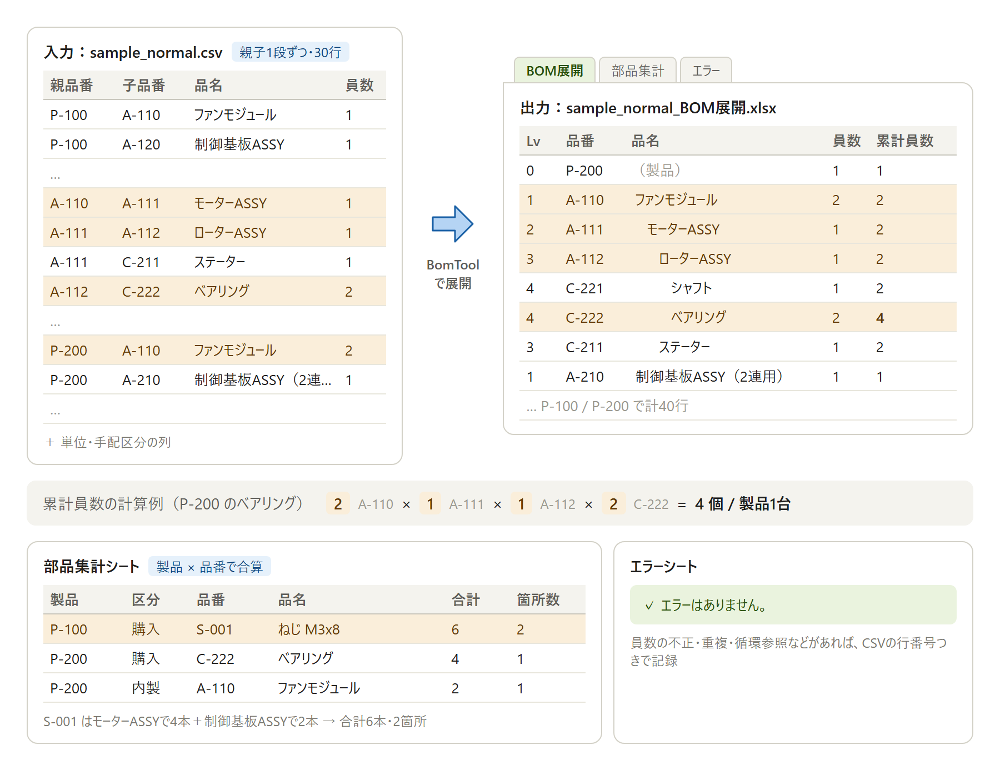

# 多段階BOM展開ツール（BomTool）

[](https://github.com/Yoji-Itagaki/BomExpander/actions/workflows/ci.yml)
[](https://github.com/Yoji-Itagaki/BomExpander/releases/latest)

部品表（BOM）の親子関係が入ったCSVを読み込み、製品ごとに多段階展開した部品表をExcelファイル（.xlsx）に出力するWindowsツールです。

- Excelがインストールされていないパソコンでも動きます（[ClosedXML](https://github.com/ClosedXML/ClosedXML) で .xlsx を直接作成）
- 外部への通信は一切行いません
- 同梱のデータはすべて架空のダミーデータです

## 変換イメージ

親子関係を1段ずつ書いたCSVから、製品ごとに展開したツリーと累計員数（製品1台あたりの数量）をExcelに出力します。累計員数は、製品からその部品までの経路にある員数を掛け合わせて求めます。



## ダウンロード（すぐに試す場合）

[Releases](https://github.com/Yoji-Itagaki/BomExpander/releases/latest) から `BomTool-vX.X.X-win-x64.zip` をダウンロードして展開し、`BomTool.exe` を起動します。
.NET ランタイムを同梱しているため、追加のインストールは不要です。`samples` フォルダーのダミーCSVで動作を試せます。

> 初回起動時に「Windows によって PC が保護されました」と表示された場合は、「詳細情報」→「実行」を押してください（コード署名をしていないため表示されます）。

## 動作環境

| 項目 | 内容 |
|---|---|
| OS | Windows 10 / 11（64bit） |
| 実行に必要なもの | [.NET 10 デスクトップ ランタイム](https://dotnet.microsoft.com/download/dotnet/10.0)（自己完結型で発行した場合は不要） |
| ビルドに必要なもの | .NET 10 SDK（Visual Studio 2026 でも可） |
| 言語・画面 | VB.NET / Windowsフォーム |

## フォルダー構成

```
BomTool/
├─ BomTool.sln
├─ src/
│  ├─ BomTool.Core/          … 処理本体（画面に依存しないクラスライブラリ）
│  │  ├─ CsvBomReader.vb      … CSV読み込み（文字コード判定・行のチェック）
│  │  ├─ BomTreeExpander.vb   … BOM展開（累計員数・循環参照の検出・部品集計）
│  │  ├─ ExcelExporter.vb     … Excel出力（3シート・書式・印刷設定）
│  │  └─ Models/              … データを入れるクラス（BomRow, ExpandedLine など）
│  └─ BomTool.App/           … 画面（Windowsフォーム）
│     ├─ Program.vb           … 起動処理・想定外の例外の受け口
│     └─ MainForm.vb          … メイン画面
├─ tests/
│  └─ BomTool.Tests/         … 単体テスト（xUnit）
├─ docs/
│  └─ images/                … README用の画像
└─ samples/
   ├─ sample_normal.csv      … 正常なダミーデータ（UTF-8 BOM付き）
   ├─ sample_errors.csv      … エラーを含むダミーデータ（Shift_JIS）
   └─ output/                … 上の2ファイルを実際に出力したExcel
```

### 処理の流れ

```
MainForm（画面）
  │ CSVを選択 → 保存先を選択
  ▼
CsvBomReader.ReadFile      … 文字コード判定 → CSV解析 → 行のチェック（不正な行はエラーに記録して読み飛ばす）
  ▼
BomTreeExpander.Expand     … 最上位品番を探す → 深さ優先で展開・累計員数を計算 → 循環参照の検出 → 部品集計
  ▼
ExcelExporter.Export       … 「BOM展開」「部品集計」「エラー」の3シートを出力
  ▼
MainForm（画面）           … 製品数・部品行数・エラー件数を表示
```

## ビルド方法

### コマンドの場合

```bash
dotnet build BomTool.sln -c Release
```

実行ファイルは `src/BomTool.App/bin/Release/net10.0-windows/BomTool.exe` にできます。

単体テストの実行：

```bash
dotnet test BomTool.sln
```

配布用に1つのフォルダーにまとめる場合（.NETランタイムを含めた自己完結型）：

```bash
dotnet publish src/BomTool.App/BomTool.App.vbproj -c Release -r win-x64 --self-contained true -o publish
```

### Visual Studio の場合

`BomTool.sln` を開き、`BomTool.App` をスタートアッププロジェクトにして実行します。テストは「テスト エクスプローラー」から実行できます。

## 使い方

1. `BomTool.exe` を起動します。
2. 「CSVを選択...」ボタンで部品表のCSVファイルを選びます。
3. 「展開してExcelに出力」ボタンを押し、保存先とファイル名を選びます（初期値は `元のファイル名_BOM展開.xlsx`）。
4. 処理が終わると、画面に「製品数」「部品行数」「エラー件数」「CSVの文字コード」「出力ファイル」が表示されます。出力したファイルをそのまま開くこともできます。
5. エラーが1件以上あれば、Excelの「エラー」シートで内容を確認してください。

> 出力先のファイルをExcelで開いたまま上書きしようとすると保存に失敗します。その場合はファイルを閉じてから再実行してください（ツールは落ちずにメッセージを表示します）。

## 入力CSVの仕様

| 項目 | 内容 |
|---|---|
| 文字コード | UTF-8（BOM付き・なし）、Shift_JIS（自動判定） |
| 改行 | CRLF / LF / CR のどれでも可 |
| 1行目 | ヘッダー（読み飛ばします） |
| 区切り | カンマ。値にカンマや `"` を含む場合はダブルクォートで囲む（`"部品J（φ5,黒）"`） |

### 列（この順番で並べてください）

| 列 | 名前 | 必須 | 内容 |
|---|---|---|---|
| 1 | 親品番 | ○ | 親の品番 |
| 2 | 子品番 | ○ | 親の下に付く品番 |
| 3 | 品名 | ○ | 子品番の品名 |
| 4 | 員数 | ○ | 親1個あたりの子の数。0より大きい数値（小数可。全角数字も可） |
| 5 | 単位 | ○ | 個、本、m など |
| 6 | 手配区分 | ○ | `購入` または `内製` |

- 1行が「親品番の下に子品番が員数分付く」という親子関係を表します。
- どの行の子品番にもなっていない親品番を **製品（最上位）** として扱います。
- 値の前後の空白は取り除きます。7列目以降は無視します。

### 例

```csv
親品番,子品番,品名,員数,単位,手配区分
P-100,A-110,ファンモジュール,1,個,内製
A-110,C-201,ファン羽根,1,個,購入
A-110,C-202,ファンガード,2,個,購入
```

## 出力Excelの仕様

### シート「BOM展開」

| 列 | 内容 |
|---|---|
| レベル | 0が製品、その下が1、2、… |
| 品番 | レベルに応じて字下げ（1レベルにつき2文字分） |
| 品名 | 子品番の品名（製品の行は空） |
| 員数 | 直上の親1個あたりの数（CSVの値） |
| 累計員数（製品1台あたり） | 上位の員数をすべて掛け合わせた値 |
| 単位 / 手配区分 | CSVの値 |

製品ごとに、製品の行（色付き・太字）→ その下の部品の順に並びます。子の並び順はCSVの順番どおりです。

### シート「部品集計」

製品ごとに、同じ品番の累計員数を合算した一覧です。並び順は「製品 → 手配区分（購入 → 内製）→ 品番」です。
列：製品品番、手配区分、品番、品名、合計員数（製品1台あたり）、単位、使用箇所数（部品表の中でその品番が出てくる箇所の数）

### シート「エラー」

列：行番号（CSVの行番号。ヘッダーが1行目）、エラー種別、内容、元データ。エラーがない場合は「エラーはありません。」と出力します。

### 共通の書式

見出し行の固定、オートフィルター、罫線（内側は細線・外枠は中太線）、列幅の自動調整、印刷設定（A4、横幅を1ページに収める、見出し行を各ページに印刷、ページ番号）。

## エラー処理

| エラー種別 | 条件 | 動作 |
|---|---|---|
| CSV形式 | 列が6列に足りない／ファイルが空 | その行を読み飛ばす |
| 必須列が空 | 6列のどれかが空 | その行を読み飛ばす（空の列名を表示） |
| 員数が不正 | 数値でない、または0以下 | その行を読み飛ばす |
| 手配区分が不正 | `購入`・`内製` 以外 | その行を読み飛ばす |
| 親子の重複 | 同じ「親品番＋子品番」が2回以上ある | **最初の行を使い**、2件目以降を読み飛ばす |
| 循環参照 | 親子関係がループしている（A→B→A、A→A など） | ループに戻る手前で展開を止める。同じループは1回だけ記録 |
| 製品なし | 最上位の品番が1つもない（すべてがループの中にある） | 何も展開しない |

- 製品からたどれない場所にあるループ（上に製品がない X→Y→X など）も検出してエラーに記録します。
- 展開結果がExcelの行数上限に近い100万行を超える場合は、処理を中止してメッセージを表示します。
- ファイルの読み書きの失敗など、想定外のエラーが起きてもツールは終了せず、メッセージを表示します。

## サンプルデータ

| ファイル | 内容 |
|---|---|
| `samples/sample_normal.csv` | 製品2つ（P-100 送風ユニット、P-200 2連送風ユニット）、30行。製品の下に最大4レベル（レベル0〜4）。共通の組品（A-110）や小数の員数（1.5m）を含みます |
| `samples/sample_errors.csv` | 上の「エラー処理」の各エラーを1つ以上含みます（員数の不正、必須列が空、手配区分の不正、重複、循環参照、製品からたどれないループ、列不足）。Shift_JISで保存しています |
| `samples/output/*.xlsx` | 上の2ファイルを実際に出力した結果 |

## 単体テスト

`tests/BomTool.Tests` に、次の内容のテストがあります（xUnit）。

- 累計員数の計算（多段階の掛け算、小数、共通部品、レベル、並び順）
- 部品集計（同じ品番の合算、並び順）
- 循環参照の検出（ループ、自己参照、複数製品からの到達、製品からたどれないループ、製品なし、ループでないひし形の構成）
- エラー行の扱い（員数の不正、必須列が空、列不足、手配区分の不正、重複、正しい行が残ること）
- CSVの解析（ダブルクォート、全角数字、LF改行、空ファイル）
- 文字コードの判定（UTF-8 BOM付き／なし、Shift_JIS）
- Excel出力（シート名、見出し、字下げ、累計員数、罫線、エラーシート）
- サンプルCSVの展開結果

## 自動ビルドとリリース（GitHub Actions）

| 設定ファイル | 動くタイミング | 内容 |
|---|---|---|
| `.github/workflows/ci.yml` | main への push、Pull Request | ビルドと単体テスト |
| `.github/workflows/release.yml` | `v` で始まるタグの push | 単体テスト → 自己完結型で発行 → zip作成 → Releases に公開 |

新しいバージョンを公開する手順（例：v1.1.0）：

```bash
git tag v1.1.0
```

```bash
git push origin v1.1.0
```

数分後に [Releases](https://github.com/Yoji-Itagaki/BomExpander/releases) に zip が公開されます。進み具合はリポジトリの「Actions」タブで確認できます。リリースの説明文の冒頭は `.github/release-notes.md` の内容で、その後ろに変更履歴が自動で追加されます。

## ライセンス

使用ライブラリ：ClosedXML（MIT License）、xUnit（Apache License 2.0）
